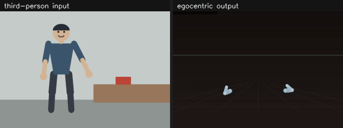

# bird2ego

bird2ego turns third-person ("bird's-eye") video of a person doing a manual task
into a structured, machine-readable record of that task. The pipeline loads the
video, detects and tracks objects, estimates 2D and 3D human pose, infers
hand-object contact events, classifies each interaction, segments the video into
action steps, re-projects the scene into a first-person (egocentric) view, and
builds a task graph whose nodes carry preconditions and postconditions. Every
stage writes to one shared timeline, so all exported JSON files use the same
frame indices and timestamps.



The right pane is `egocentric.mp4` from a real run. See "Demo GIF" below for the
exact commands.

## Pipeline

```
             video file (mp4/mov/avi)
                        |
              [1] VideoLoader           frames + timestamps + metadata
                        |
              [2] TemporalAlignment     one shared Timeline (fps, t0, frames)
                        |
        +---------------+---------------+
        |                               |
  [3] ObjectDetector              [5] PoseEstimator2D      (stub | mediapipe)
      ObjectTracker  (IoU)            PoseLifter3D  (stub | mediapipe_world)
      TrajectoryBuilder                PoseTracker          (One Euro smoothing)
        |                               KinematicsProcessor
  [4] StateClassifier                   |
      (motion-only pass)                |
        +---------------+---------------+
                        |
              [6] ContactDetector       wrist/hand vs object-box distance
                        |
              [7] InteractionClassifier grasp / push / hold / touch
                        |
              [8] EventExtractor        discrete contact events
                        |
              [9] StateClassifier       refine states using contacts
                        |
             [10] ActionSegmenter       boundaries from state changes
                  SkillBoundaryDetector merge + hysteresis
                  ActionClassifier      label each segment
                        |
             [11] Precondition/PostconditionExtractor
                        |
             [12] OrderingInferencer -> TaskGraphBuilder   (NetworkX DiGraph)
                        |
             [13] EgocentricStage       head frame, arms, hands, objects
                  EgocentricRenderer    synthetic first-person video
                        |
             [14] validate timeline
                        |
             [15] JSONExporter + GraphExporter + egocentric export
                        |
        timeline.json  pose.json  objects.json  contacts.json
        actions.json   task_graph.json  task_graph.graphml
        egocentric.json  egocentric.mp4
```

## Egocentric stage

Stage 13 turns the third-person timeline into a first-person one. It runs inside
`PipelineOrchestrator`, gated by the `egocentric` config block.

For every frame the stage:

1. Reads the 3D body pose the lifter produced.
2. Estimates the head frame: eye position, forward, up, and right.
3. Re-expresses the arms (shoulder, elbow, wrist) in that frame.
4. Re-expresses the 21 hand landmarks in that frame, when `detect_hands` is on.
5. Maps every tracked object box centre into that frame.

The egocentric frame is `x=right, y=down, z=forward`, with the origin at the eye.
Units are metres when `backend_3d` is `mediapipe_world`.

The stage needs real metric 3D. `backend_3d: mediapipe_world` supplies it:
MediaPipe Pose Landmarker returns `pose_world_landmarks` in metres, rooted at the
hip midpoint, in the same axis convention the pipeline uses. The
`mediapipe_world` lifter re-roots those joints and passes them through. It writes
sentinels for frames without world landmarks. It never invents 3D data.

Object tracks carry 2D boxes only. The stage fits a uniform scale and offset
between the 2D and 3D joints of the same frame, then maps the box centre through
that fit onto the torso depth plane. That places the object in the ego frame, but
it is a planar approximation, not measured depth.

The live test bench `scripts/webcam_test.py` drives the same transformer and
renderer for a camera feed.

## Quick start

Install the dependencies.

```bash
python3 -m venv .venv
source .venv/bin/activate
pip install -r requirements.txt
```

Run the pipeline with the real backends.

```bash
python scripts/process_video.py \
  --config configs/real.yaml \
  --input path/to/video.mp4 \
  --out outputs/run1
```

The first run downloads the model weights. MediaPipe caches its pose landmarker
in `~/.cache/mediapipe`. Ultralytics downloads `yolov8n.pt` into the working
directory.

Run the pipeline with no model downloads. The stub config produces synthetic
poses and detections, which is useful to check the plumbing.

```bash
python scripts/process_video.py --config configs/default.yaml --input video.mp4
```

The repo ships no sample footage. Render a synthetic clip to try the pipeline.

```bash
python scripts/make_synthetic_video.py -o data/samples/synthetic_reach.mp4
```

The clip is a drawing of a person reaching for a box. MediaPipe finds the body in
it, which makes it a smoke test. It is not accuracy evidence.

Watch the stages live from a webcam.

```bash
python scripts/webcam_test.py            # press E for the egocentric view
python scripts/video_test.py video.mp4   # same view for a file
```

## Configuration

Both configs share one schema. `bird2ego/utils/config.py` loads the YAML into
dataclasses and applies defaults for missing keys.

| File | Purpose |
| --- | --- |
| `configs/default.yaml` | All model backends stubbed. No downloads, no GPU. The egocentric stage runs. |
| `configs/real.yaml` | MediaPipe 2D pose, MediaPipe metric 3D joints, MediaPipe hands, and YOLOv8 detection. |

Key sections:

- `video` — target fps and a frame cap.
- `frame` — resize policy (`none`, `resize`, `letterbox`, `crop_center`) and size.
- `pose` — `backend_2d` (`stub` or `mediapipe`), `backend_3d` (`stub` or
  `mediapipe_world`), joint confidence floors, and smoothing (`none`,
  `moving_average`, `exponential`, `one_euro`).
- `objects` — `detector_backend` (`stub` or `yolo`), class filter, confidence
  threshold. YOLO expects COCO class IDs. The stub expects class names.
- `tracker` — IoU tracker thresholds, track age, and gap interpolation.
- `contact` — pixel distance threshold and onset/offset hysteresis.
- `interaction` — motion and duration thresholds for grasp and push.
- `segmentation` — minimum segment length, merge threshold, and which state
  changes create a boundary.
- `state` — motion threshold plus the fixture and container class lists.
- `graph` — whether causal edges require a shared object, the confidence floor,
  and the temporal fallback.
- `egocentric` — see the table below.
- `output` — JSON indent level.

`backend_3d` accepts `stub` and `mediapipe_world`. `PoseLifter3D` raises
`ValueError` for any other value. `mediapipe_world` needs `backend_2d:
mediapipe`, because MediaPipe is what supplies the world landmarks.

### `egocentric` block

| Key | Default | Meaning |
| --- | --- | --- |
| `enabled` | `false` | Run stage 13. When false the pipeline writes no ego output. |
| `export_frames` | `true` | Write `egocentric.json`. |
| `render` | `false` | Write `egocentric.mp4`. |
| `detect_hands` | `false` | Run the MediaPipe hand landmarker for 21 landmarks per hand. Needs MediaPipe. |
| `hand_min_confidence` | `0.5` | Hand landmarker detection and tracking confidence. |
| `render_width`, `render_height` | `960`, `720` | Render size in pixels. |
| `fov_horizontal` | `90.0` | Render horizontal field of view, in degrees. |
| `gaze_down_angle` | `30.0` | How far down the head model points the gaze, in degrees. |
| `eye_offset_forward` | `0.1` | Eye offset ahead of the head centre, in metres. |
| `pinch_threshold` | `0.05` | Thumb tip to index tip distance that counts as a pinch, in metres. |

Both shipped configs enable the stage. `configs/real.yaml` also sets
`detect_hands: true`.

## Outputs

Each run writes seven files into the output directory, plus two more when the
egocentric stage is enabled.

| File | Contents |
| --- | --- |
| `timeline.json` | Run metadata: `run_id`, `fps_extracted`, `t0`, `timestamp_source`, `frame_to_time_rule`, `num_frames`, `duration`, and a per-frame list of `frame_idx`, `t`, `width`, `height`. |
| `pose.json` | `run`, `image` (width, height, `space`), and `person` with the per-frame 2D and 3D joint arrays, per-joint confidence, and the coordinate-frame and unit conventions. |
| `objects.json` | One entry per track: `object_id`, `class_name`, per-frame `bbox_xyxy` and `conf`, and a per-frame `state` with `support_relation`, `motion_state`, `interaction_state`, and `containment`. |
| `contacts.json` | `num_events`, `event_scope`, and `events`. Each event has `event_id`, `type`, `t_start`, `t_end`, `frame_start`, `frame_end`, `hand`, `object_id`, `label`, `conf`, and `evidence`. |
| `actions.json` | `num_segments` and `segments`. Each segment has `seg_id`, `t_start`, `t_end`, `frame_start`, `frame_end`, `label`, `conf`, `objects_involved`, and `evidence`. |
| `task_graph.json` | `nodes`, `edges`, and `metadata` (`num_nodes`, `num_edges`, `is_dag`, `num_causal_edges`, `num_temporal_edges`). Edges carry `source`, `target`, and `edge_type` (`causal` or `temporal`). |
| `task_graph.graphml` | The same graph in GraphML, for Gephi, Cytoscape, or `networkx.read_graphml`. |
| `egocentric.json` | `video_info`, `num_frames`, `action_labels`, and `frames`. Each frame has `head` (`position`, `forward`, `up`, `right`, `confidence`), `left_hand` and `right_hand` (`landmarks_3d`, `pinching`, `pinch_distance`, `confidence`), `left_arm` and `right_arm` (`keypoints_3d`: shoulder, elbow, wrist), and `objects` keyed by object id. All coordinates are in the ego frame. |
| `egocentric.mp4` | The synthetic first-person render, written when `egocentric.render` is true. |

All files carry `"schema_version": "1.0"`. `GraphExporter.load_json` and
`GraphExporter.load_graphml` read the graph back into NetworkX.

## Tests

```bash
pytest tests/ -q
```

The tests cover timeline monotonicity and alignment, the pose export schema,
task-graph export and reload, the egocentric transform against a known synthetic
pose, and a full stub-backend run that must produce ego frames. They need
`numpy`, `pyyaml`, `pydantic`, `networkx`, `opencv-python`, and `pytest`. They do
not need MediaPipe or ultralytics.

## Demo GIF

`assets/demo.gif` comes from a real run, not a mock-up. Reproduce it with:

```bash
python scripts/make_synthetic_video.py -o data/samples/synthetic_reach.mp4
python scripts/process_video.py --config configs/real.yaml \
  --input data/samples/synthetic_reach.mp4 --out outputs/real
python scripts/make_demo_gif.py --source data/samples/synthetic_reach.mp4 \
  --ego outputs/real/egocentric.mp4 --out assets/demo.gif
```

## Layout

```
bird2ego/
├── configs/
│   ├── default.yaml          stub backends
│   └── real.yaml             mediapipe + yolo
├── assets/
│   └── demo.gif              input beside the egocentric render
├── scripts/
│   ├── process_video.py      CLI entry point
│   ├── make_synthetic_video.py  renders a test clip
│   ├── make_demo_gif.py      builds assets/demo.gif from a run
│   ├── video_test.py         per-stage viewer for a video file
│   └── webcam_test.py        live viewer, includes the egocentric window
├── bird2ego/
│   ├── pipeline.py           PipelineOrchestrator, run_pipeline
│   ├── video/                loader, frame processing, temporal alignment
│   ├── pose/                 2D estimator, 3D lifter, smoothing, kinematics
│   ├── objects/              detector, IoU tracker, trajectories, states
│   ├── contact/              hand detection, contact and interaction logic
│   ├── actions/              segmentation, boundary refinement, labels
│   ├── graph/                pre/postconditions, ordering, graph builder
│   ├── egocentric/           stage, transform, renderer, exporter
│   ├── output/               JSON and graph exporters
│   └── utils/                config loading, Timeline data model
├── tests/
├── requirements.txt
└── README.md
```
